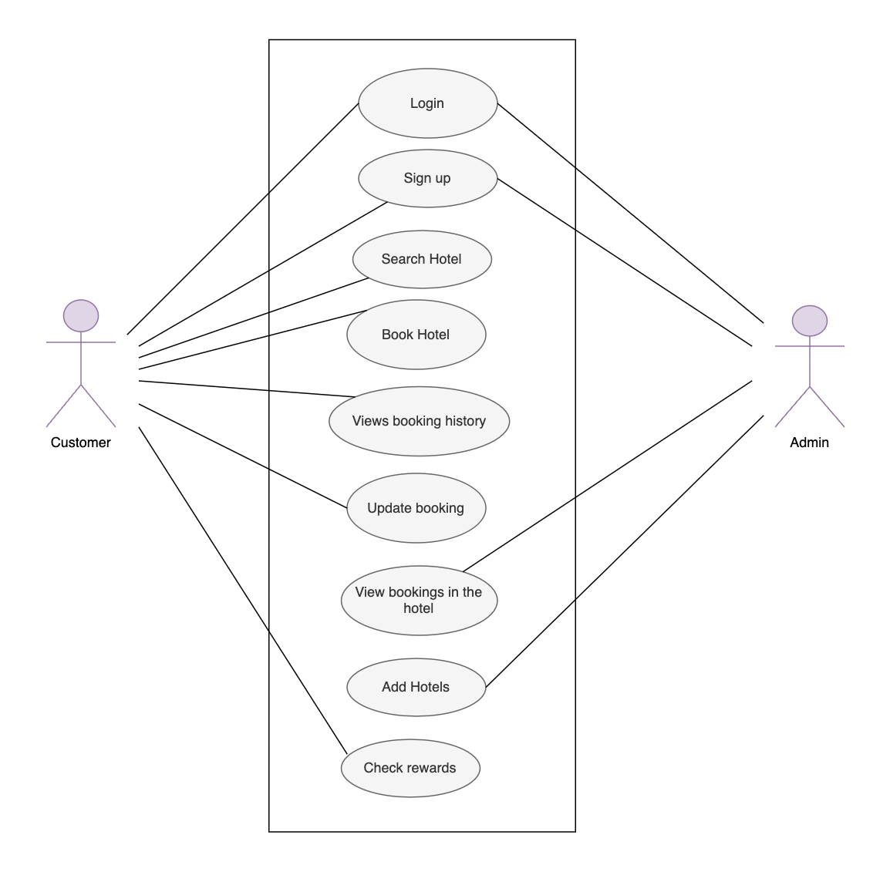
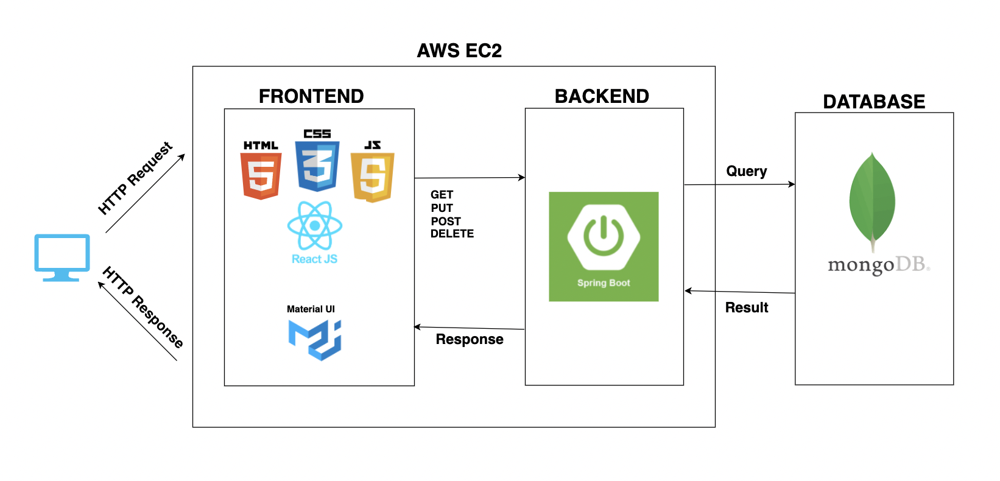

# Group 12 - Incognito - Hotel Booking 

# Team Memebers :

1) Shreyansh Upadhyay 

2) Ravindar Reddy 

3) Preethi Billa 

4) Mounica Reddy

# Tools Used:

 * Frontend: React JS
 * Backend: SpringBoot
 * Database: MongoDB
 * REST API: Postman (for testing developed APIs)
 * Cloud: Amazon Web Services (AWS) EC2 Cluster

# Schedule for Scrum Meetings:

 * Friday
 * Tuesday

# Task Allocations:

 * FrontEnd : Shreyansh, Mounica, Preethi
 * Backend : Ravindar
 * Integration of Backend and Frontend : Shreyansh, Ravindar
 * Deployment : Shreyansh , Ravindar, Mounica, Preethi
 * Documentation : Mounica, Preethi, Shreyansh, Ravindar

# XP Core Values:

 * Communication
 * Courage
 * Simplicity
 * FeedBack

# Project Board

The Project Board is available [here](https://github.com/gopinathsjsu/team-project-incognito/projects/2)

# Sprint Sheet:

[Sprint Sheet](https://github.com/gopinathsjsu/team-project-incognito/blob/main/Documentation/Sprint_Sheet.xlsx)

# Project Journal:

The entire documentation for the Journals is present on the following link [Documentation](https://github.com/gopinathsjsu/team-project-incognito/tree/main/Documentation)

# Usecase Diagram:

# UI WireFrame

* Register

 

* Login

 

* Search Rooms

 

* Manage Booking

 

* Home Page

 

* Admin add rooms

 

* Admin manage booking

 

# Architecture Diagram:

# Design Decision:

## Application Level:

### Admin Features:

    1. Signin
    2. View all Bookings
    3. Add new Location for each Hotel

### User Features:

    1. Signup/ Signin
    2. Search for Hotel Location
    3. Select the booking Date and the amenities
    4. View all the Booking
    5. Update the booking
    6. Delete the booking
    7. View his current Reward Points

